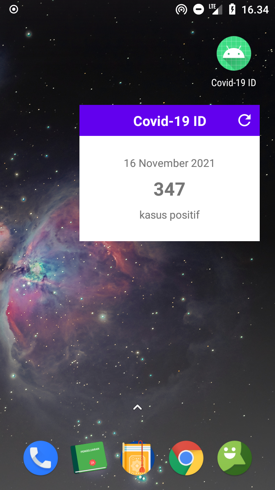

# Covid-19 ID

Aplikasi Android yang menampilkan tren kasus positif Covid-19 di Indonesia. Data diambil dari API Gugus Tugas Percepatan Penanganan Covid-19. Screenshot di bawah adalah tren dari 2 Maret - 5 Desember 2020. Semoga pandemi ini segera berlalu.

Tampilan Utama                              | Widget Aplikasi
--------------------------------------------|----------------------------------------------
|

Aplikasi ini menggunakan beberapa library, diantaranya:
- Retrofit, untuk request data ke server
- Moshi, untuk mengubah JSON string ke POJO
- MPAndroidChart, untuk menampilkan grafik

Punya pertanyaan atau masukan? Silahkan disampaikan melalui issue repository ini.

## Lisensi

Copyright (c) 2020 Indra Azimi. All rights reserved.

Dibuat untuk kelas Pemrograman untuk Perangkat Bergerak 2. Dilarang melakukan penggandaan dan atau komersialisasi, sebagian atau seluruh bagian, baik cetak maupun elektronik terhadap project ini tanpa izin pemilik hak cipta.
